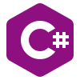

<h1 align="center"><b>Hi , I'm Fernandez Juan </b></h1>

  

##  About me

- 👨‍💻I am currently working on several projects while improving my English.
- 💡  I enjoy exploring new technologies and developing software solutions and quick hacks.
- 🎓 I am currently studying a programming degree at the National Technological University.
- ✉️ You can visit my [portfolio](https://fernandez-juan.site/) for more details about me. I am open to feedback and suggestions!
- 💬 Feel free to contact me for more information [linkedin](https://www.linkedin.com/in/juan-f-36ba26260/)

# 💻 Tech Stack  

## 🔥 My statistics 🔥

| Lenguajes | Stats |
|-----------|-------|
|  |  |

    

