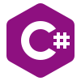

<h1 align="center"><b>Hi , I'm Juan Fernandez </b></h1>

 

## About me

* 💖 I am passionate about cybersecurity, building systems, trying to break them, and understanding how they work.
* 👨‍💻 I currently work independently on software development, automation, and cybersecurity-related projects.
* 🎓 I recently graduated from the National Technological University (UTN) with a degree in Programming.
* 🔐 I am currently expanding my knowledge in cybersecurity, with a focus on Blue Team, SOC, vulnerability analysis, and security automation.
* 💻 I enjoy working with hardware, including retro hardware, and exploring how technology works from both the software and hardware sides.
* 💡 I enjoy exploring new technologies, building software solutions, and experimenting with new ideas.
* ✉️ You can visit my [portfolio](https://juan-fernandez.vercel.app/) to learn more about me. I am always open to feedback and suggestions!
* 💬 Feel free to contact me through [LinkedIn](https://www.linkedin.com/in/juan-f-36ba26260/) if you would like to get in touch.

# 💻 Tech Stack  

## 🔥 My statistics 🔥

| Lenguajes | Stats |
|-----------|-------|
|  |  |

    

