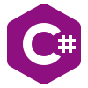

<h1 align="center"><b>Hi , I'm Fernandez Juan </b></h1>

  

	
## <picture></picture> About me

<picture> </picture>

👨‍💻 I'm currently working on projects to showcase my knowledge of the programming languages I use while also improving my English.\
💡  I enjoy exploring new technologies and developing software solutions and quick hacks\
🎓 I am currently studying a programming degree at the National Technological University.\
✉️ You can visit my [portfolio](https://fernandezjuan.vercel.app/) for more details about me. I am open to feedback and suggestions!\
💬 Feel free to contact me for more information [linkedin](https://www.linkedin.com/in/juan-f-36ba26260/)

# 💻 Tech Stack  

